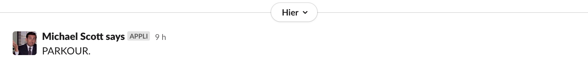
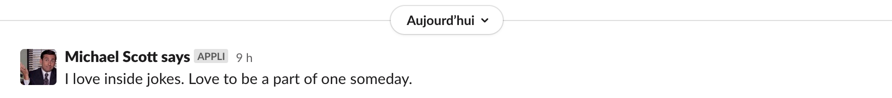

# Application Slack Michael Scott Says

Cette application permet de publier automatiquement des citations de Michael Scott (The Office) sur un canal slack dont vous avez les droits.  

**Exemples :**






## Réalisation
J'ai réalisé ce projet Node.js lors de ma troisième semaine de spécialisation en API/data (quatrième mois de formation en développement web FS JavaScript).

En plus des stacks listés plus bas, j'ai utilisé une [API existante qui génère des citations de Michael de manière aléatoire](https://michael-scott-quotes.herokuapp.com/quote).

Une fois l'application fonctionnelle, il a fallu la connecter à un compte Slack et mettre en place une Crontab pour automatiser les publications. 

## Stacks
- Node.js
- Express
- node-fetch

## Langages utilisés
- JavaScript


## Installation
Node est requis pour utiliser ce code, pour le télécharger c'est ici :)

1. Cloner le repo
- en utilisant la clé SSH
```
git clone git@github.com:sarah-maau/api-bullshit-generator.git
```
- en utilisant HTTPS
```
git clone https://github.com/sarah-maau/api-bullshit-generator.git
```

2. Installer les dépendances
```
npm i
```

3. Créer un fichier .env reprenant les informations fournies dans le document .env.example

NB : dans ce fichier, il est demandé de renseigner `SLACK_WEBHOOK`. Pour ce faire, merci de suivre les étapes du fichier [`slack.md`](docs/slack.md)

4. Une fois l'application Slack créer, lancer le script
```
npm start
```
5. Mettre en place la publication automatique des posts via Crontab (Linux), merci de suivre les étapes du fichier [`crontab.md`](docs/crontab.md)

## Auteur
Sarah Maury - [GitHub](https://github.com/sarah-maau) - [LinkedIn](https://www.linkedin.com/in/sarahmaurydev/)

## Licence
Ce projet est sous licence MIT - voir le fichier `LICENSE` pour plus de détails