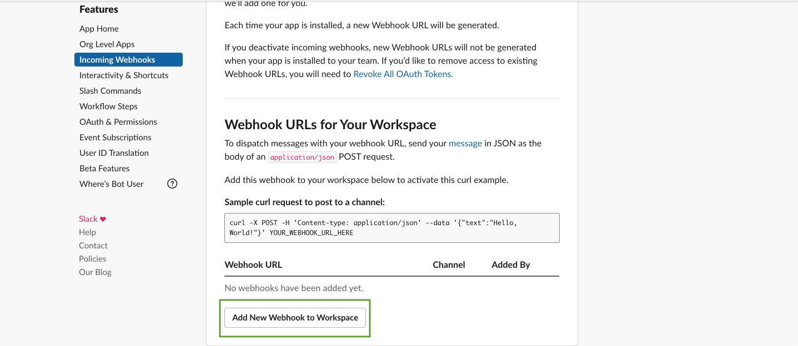

# Créer une application Slack

Pour créer une application Slack, rendez-vous sur [Slack Api](https://api.slack.com/)

1. Cliquer sur `Create a custom app`
   
2. Donner un nom (ici *Michael Scott says*) et ajouter l'espace de travail concerné (il faut être **détenteur des droits**)

3. Une fois arrivé sur le dashboard, cliquer sur `Incoming Webhooks`...
   

... puis switcher le bouton `Active Incoming Webhooks` sur la position **On**

4. Cliquer ensuite sur `Add New Webhook to Workspace`

5. Sélectionner le canal où les publications devront être postées 

6. Copier `Webhook URL` et coller dans le `.env` (`SLACK_WEBHOOK=`)